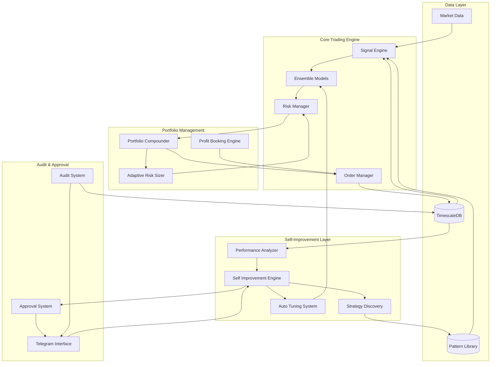
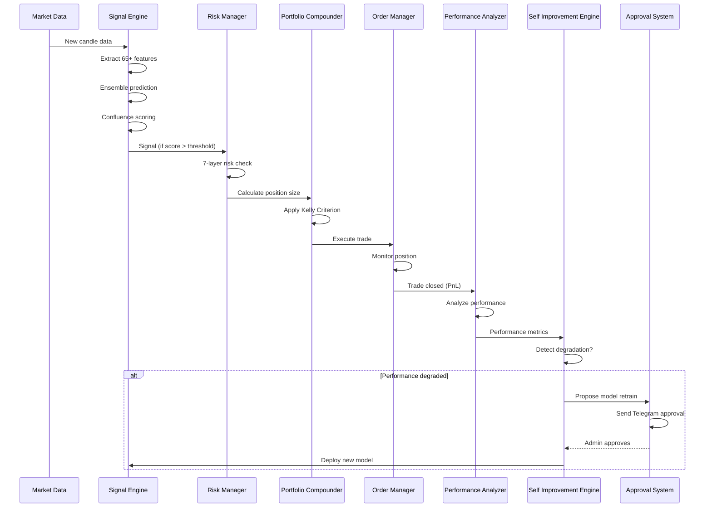

# Design Document: Self-Improving Portfolio Fund Compounder

## Overview

This design document specifies the technical architecture for transforming the existing AI trading bot into an autonomous, self-learning portfolio fund compounder. The system will operate across cryptocurrency and forex markets, continuously learning from trading patterns, automatically tuning strategies, and compounding funds through intelligent portfolio management.

### Design Goals

1. **Autonomous Learning**: System improves accuracy over time without manual intervention
2. **Strategy Discovery**: Automatically identifies and validates profitable trading patterns
3. **Fund Compounding**: Exponential growth through intelligent position sizing and profit reinvestment
4. **Multi-Market Support**: Concurrent trading across crypto and forex with separate models
5. **Scientific Validation**: All changes validated through walk-forward testing before deployment
6. **Safety First**: Comprehensive approval system and circuit breakers prevent catastrophic losses

### Existing System Foundation

The current trading bot provides:
- **AI/ML Infrastructure**: XGBoost and ensemble models (RandomForest, GradientBoosting, LogisticRegression)
- **Risk Management**: Seven-layer risk protection with circuit breakers
- **Backtesting**: Walk-forward validation with time-series aware splits
- **Telegram Integration**: Command interface and notifications
- **Database**: TimescaleDB for time-series data storage
- **Execution**: Paper trading and live execution with order management
- **Signal Generation**: 65+ technical features with confluence scoring

## Architecture

### High-Level System Architecture



### Component Interaction Flow



## Components and Interfaces

### 1. Audit System

**Purpose**: Analyze existing codebase and generate comprehensive audit reports

**Location**: `src/audit/audit_engine.py`

**Key Classes**:
- `CodebaseAuditor`: Main audit orchestrator
- `StructureAnalyzer`: Analyzes directory structure and module organization
- `QualityAnalyzer`: Evaluates code quality metrics
- `GapAnalyzer`: Compares current vs target capabilities
- `ReportGenerator`: Generates markdown audit reports

**Interface**:
```python
class CodebaseAuditor:
    def __init__(self, root_dir: str = "src"):
        self.root_dir = root_dir
        self.structure_analyzer = StructureAnalyzer()
        self.quality_analyzer = QualityAnalyzer()
        self.gap_analyzer = GapAnalyzer()
        self.report_generator = ReportGenerator()
    
    async def run_full_audit(self) -> AuditReport:
        """Execute complete codebase audit"""
        structure = await self.structure_analyzer.analyze(self.root_dir)
        quality = await self.quality_analyzer.analyze(self.root_dir)
        gaps = await self.gap_analyzer.analyze(structure, REQUIREMENTS)
        return self.report_generator.generate(structure, quality, gaps)
    
    async def generate_report(self, output_path: str = "audit_report.md"):
        """Generate and save audit report"""
        report = await self.run_full_audit()
        await report.save(output_path)
        return report

@dataclass
class AuditReport:
    timestamp: str
    structure_summary: Dict
    quality_metrics: Dict
    identified_gaps: List[Gap]
    recommendations: List[Recommendation]
    priority_matrix: Dict
    
    def save(self, path: str):
        """Save report as markdown"""
        pass
```

**Integration Points**:
- Reads all source files in `src/` directory
- Analyzes database models in `src/database/models.py`
- Evaluates test coverage from `tests/` directory
- Generates report accessible via Telegram `/audit` command

### 2. Self-Improvement Engine

**Purpose**: Continuously learn from trading history and improve model accuracy

**Location**: `src/ml/self_improvement_engine.py`

**Key Classes**:
- `SelfImprovementEngine`: Main orchestrator
- `PerformanceTracker`: Tracks win rate, profit factor, Sharpe ratio
- `ModelRetrainer`: Handles weekly model retraining
- `DeploymentManager`: Manages model versioning and deployment

**Interface**:
```python
class SelfImprovementEngine:
    def __init__(
        self,
        model_dir: str = "models",
        data_fetcher: DataFetcher = None,
        min_precision_improvement: float = 0.02,  # 2%
        retrain_schedule_hours: int = 168,  # Weekly
    ):
        self.model_dir = model_dir
        self.data_fetcher = data_fetcher
        self.min_improvement = min_precision_improvement
        self.retrain_schedule = retrain_schedule_hours
        self.performance_tracker = PerformanceTracker()
        self.model_retrainer = ModelRetrainer()
        self.deployment_manager = DeploymentManager()
        self._running = False
    
    async def start(self):
        """Start continuous improvement loop"""
        self._running = True
        asyncio.create_task(self._daily_analysis_loop())
        asyncio.create_task(self._weekly_retrain_loop())
    
    async def _daily_analysis_loop(self):
        """Analyze completed trades daily"""
        while self._running:
            await asyncio.sleep(86400)  # 24 hours
            await self.analyze_daily_performance()
    
    async def analyze_daily_performance(self) -> PerformanceReport:
        """Analyze last 24h of trading"""
        trades = await self.trade_repo.get_recent_trades(hours=24)
        metrics = self.performance_tracker.calculate_metrics(trades)
        
        # Identify patterns in wins vs losses
        winning_conditions = self._extract_winning_conditions(trades)
        losing_conditions = self._extract_losing_conditions(trades)
        
        # Adjust confidence thresholds if needed
        if metrics.win_rate < 0.65:
            await self._adjust_confidence_threshold(increase=True)
        
        return PerformanceReport(
            timestamp=datetime.now(timezone.utc),
            metrics=metrics,
            winning_conditions=winning_conditions,
            losing_conditions=losing_conditions,
        )
    
    async def _weekly_retrain_loop(self):
        """Retrain models weekly"""
        while self._running:
            await asyncio.sleep(self.retrain_schedule * 3600)
            await self.retrain_all_models()
    
    async def retrain_all_models(self) -> Dict[str, ModelMetrics]:
        """Retrain models for all active symbols"""
        results = {}
        for symbol in self.active_symbols:
            result = await self.retrain_model(symbol)
            results[symbol] = result
        return results
    
    async def retrain_model(self, symbol: str) -> ModelMetrics:
        """Retrain model for specific symbol"""
        # Fetch recent 2000 bars
        df = await self.data_fetcher.get_dataframe(
            symbol, timeframe="1h", limit=2000
        )
        
        # Train new model
        new_model = StackingEnsemble(symbol=symbol)
        metrics = new_model.train(df, walk_forward_folds=5)
        
        # Validate with walk-forward
        validator = WalkForwardValidator(n_folds=5)
        report = validator.validate(df, symbol=symbol)
        
        # Compare with current model
        current_model = self._load_current_model(symbol)
        current_precision = current_model.metrics.get("precision", 0)
        new_precision = metrics.get("precision", 0)
        
        improvement = new_precision - current_precision
        
        if improvement >= self.min_improvement:
            # Propose deployment
            await self._propose_model_deployment(
                symbol, new_model, metrics, report, improvement
            )
        
        return metrics
    
    async def _propose_model_deployment(
        self,
        symbol: str,
        new_model: StackingEnsemble,
        metrics: Dict,
        validation_report: WalkForwardReport,
        improvement: float,
    ):
        """Send deployment proposal to approval system"""
        proposal = ModelDeploymentProposal(
            symbol=symbol,
            new_model_path=new_model.save(f"{self.model_dir}/pending/"),
            current_precision=self._get_current_precision(symbol),
            new_precision=metrics["precision"],
            improvement_pct=improvement * 100,
            validation_report=validation_report,
            timestamp=datetime.now(timezone.utc),
        )
        
        await self.approval_system.submit_proposal(proposal)

@dataclass
class PerformanceReport:
    timestamp: datetime
    metrics: PerformanceMetrics
    winning_conditions: List[Dict]
    losing_conditions: List[Dict]

@dataclass
class PerformanceMetrics:
    win_rate: float
    profit_factor: float
    sharpe_ratio: float
    max_drawdown: float
    total_trades: int
    avg_win_pct: float
    avg_loss_pct: float
```

**Integration Points**:
- Reads trade history from `TradeRepository`
- Uses existing `StackingEnsemble` for model training
- Uses existing `WalkForwardValidator` for validation
- Integrates with `ApprovalSystem` for deployment proposals
- Publishes events to `EventBus` for model retraining completion

### 3. Strategy Discovery Module

**Purpose**: Automatically discover and validate profitable trading patterns

**Location**: `src/ml/strategy_discovery.py`

**Key Classes**:
- `StrategyDiscoveryModule`: Main pattern mining engine
- `PatternExtractor`: Extracts patterns from trade history
- `PatternValidator`: Validates patterns using walk-forward testing
- `PatternLibraryManager`: Manages pattern storage and retrieval

**Interface**:
```python
class StrategyDiscoveryModule:
    def __init__(
        self,
        pattern_library: PatternLibrary,
        min_win_rate: float = 0.60,
        min_profit_factor: float = 1.8,
        min_sharpe: float = 2.0,
        min_trades: int = 50,
    ):
        self.pattern_library = pattern_library
        self.min_win_rate = min_win_rate
        self.min_profit_factor = min_profit_factor
        self.min_sharpe = min_sharpe
        self.min_trades = min_trades
        self.pattern_extractor = PatternExtractor()
        self.pattern_validator = PatternValidator()
    
    async def discover_patterns_monthly(self):
        """Run pattern discovery monthly"""
        trades = await self.trade_repo.get_trades_last_n_days(90)
        
        # Extract potential patterns
        candidates = self.pattern_extractor.extract_patterns(trades)
        
        # Validate each pattern
        validated_patterns = []
        for pattern in candidates:
            validation_result = await self._validate_pattern(pattern)
            if validation_result.passed:
                validated_patterns.append(pattern)
        
        # Add to pattern library
        for pattern in validated_patterns:
            await self.pattern_library.add_pattern(pattern)
        
        return validated_patterns
    
    async def _validate_pattern(
        self, pattern: TradingPattern
    ) -> PatternValidationResult:
        """Validate pattern using walk-forward testing"""
        # Get historical data for pattern's symbols
        df = await self.data_fetcher.get_dataframe(
            pattern.symbol, timeframe="1h", limit=1000
        )
        
        # Run walk-forward validation
        results = await self.pattern_validator.validate(
            pattern, df, n_folds=5
        )
        
        # Check if meets minimum thresholds
        passed = (
            results.win_rate >= self.min_win_rate and
            results.profit_factor >= self.min_profit_factor and
            results.sharpe_ratio >= self.min_sharpe and
            results.total_trades >= self.min_trades
        )
        
        return PatternValidationResult(
            pattern=pattern,
            passed=passed,
            win_rate=results.win_rate,
            profit_factor=results.profit_factor,
            sharpe_ratio=results.sharpe_ratio,
            total_trades=results.total_trades,
        )
    
    async def test_patterns_quarterly(self):
        """Test all patterns quarterly for degradation"""
        active_patterns = await self.pattern_library.get_active_patterns()
        
        for pattern in active_patterns:
            # Get recent performance
            recent_trades = await self.trade_repo.get_pattern_trades(
                pattern.id, last_n=50
            )
            
            if len(recent_trades) < 30:
                continue
            
            win_rate = sum(1 for t in recent_trades if t.pnl > 0) / len(recent_trades)
            
            # Mark as deprecated if performance degraded
            if win_rate < 0.55:
                await self.pattern_library.deprecate_pattern(
                    pattern.id,
                    reason=f"Win rate dropped to {win_rate:.1%}"
                )

@dataclass
class TradingPattern:
    id: str
    name: str
    symbol: str
    entry_conditions: Dict
    exit_conditions: Dict
    market_regime: str  # TRENDING, RANGING, VOLATILE
    timeframe: str
    discovery_date: datetime
    validation_metrics: Dict
    usage_count: int = 0
    live_win_rate: float = 0.0
    status: str = "active"  # active, deprecated

@dataclass
class PatternValidationResult:
    pattern: TradingPattern
    passed: bool
    win_rate: float
    profit_factor: float
    sharpe_ratio: float
    total_trades: int
```

**Integration Points**:
- Reads trade history from `TradeRepository`
- Uses `WalkForwardValidator` for pattern validation
- Stores patterns in `PatternLibrary` (TimescaleDB)
- Integrates with `SignalEngine` for pattern-based signal generation

### 4. Auto-Tuning System

**Purpose**: Automatically optimize hyperparameters when performance degrades

**Location**: `src/ml/auto_tuning_system.py`

**Key Classes**:
- `AutoTuningSystem`: Main optimization orchestrator
- `OptunaOptimizer`: Wraps Optuna for hyperparameter search
- `ParameterValidator`: Validates parameter combinations
- `PaperTradingValidator`: Tests parameters in paper mode

**Interface**:
```python
class AutoTuningSystem:
    def __init__(
        self,
        performance_threshold: float = 0.65,  # Trigger if win rate < 65%
        lookback_trades: int = 30,
        optuna_trials: int = 50,
    ):
        self.performance_threshold = performance_threshold
        self.lookback_trades = lookback_trades
        self.optuna_trials = optuna_trials
        self.optimizer = OptunaOptimizer()
        self.validator = ParameterValidator()
        self.paper_validator = PaperTradingValidator()
    
    async def monitor_and_optimize(self):
        """Monitor performance and trigger optimization if needed"""
        recent_trades = await self.trade_repo.get_recent_trades(
            limit=self.lookback_trades
        )
        
        if len(recent_trades) < self.lookback_trades:
            return
        
        win_rate = sum(1 for t in recent_trades if t.pnl > 0) / len(recent_trades)
        
        if win_rate < self.performance_threshold:
            logger.warning(
                f"Win rate {win_rate:.1%} below threshold {self.performance_threshold:.1%}. "
                "Triggering optimization..."
            )
            await self.optimize_parameters()
    
    async def optimize_parameters(self) -> OptimizationResult:
        """Run Optuna optimization"""
        # Get historical data for optimization
        df = await self.data_fetcher.get_dataframe(
            symbol="BTC/USDT", timeframe="1h", limit=1000
        )
        
        # Define parameter space
        param_space = {
            "confidence_threshold": (0.60, 0.85),
            "confluence_threshold": (70, 90),
            "stop_loss_multiplier": (1.5, 3.0),
            "take_profit_multiplier": (2.0, 5.0),
        }
        
        # Run optimization
        best_params = await self.optimizer.optimize(
            objective_func=self._objective_function,
            param_space=param_space,
            n_trials=self.optuna_trials,
            data=df,
        )
        
        # Validate with walk-forward
        validation_result = await self._validate_parameters(best_params, df)
        
        if validation_result.precision > self._get_current_precision():
            # Test in paper mode for 48 hours
            await self._test_in_paper_mode(best_params, duration_hours=48)
        
        return OptimizationResult(
            best_params=best_params,
            validation_metrics=validation_result,
            timestamp=datetime.now(timezone.utc),
        )
    
    def _objective_function(self, trial, data: pd.DataFrame) -> float:
        """Optuna objective function - maximize precision"""
        # Sample parameters
        conf_threshold = trial.suggest_float("confidence_threshold", 0.60, 0.85)
        confl_threshold = trial.suggest_float("confluence_threshold", 70, 90)
        sl_mult = trial.suggest_float("stop_loss_multiplier", 1.5, 3.0)
        tp_mult = trial.suggest_float("take_profit_multiplier", 2.0, 5.0)
        
        # Create temporary signal engine with these parameters
        temp_engine = FineTunedSignalEngine(
            confluence_threshold=confl_threshold,
            max_risk_pct=2.0,
            account_equity=10000.0,
        )
        
        # Run walk-forward validation
        validator = WalkForwardValidator(n_folds=5)
        report = validator.validate(data, symbol="BTC/USDT")
        
        # Return precision (what we want to maximize)
        return report.oos_precision
    
    async def _validate_parameters(
        self, params: Dict, df: pd.DataFrame
    ) -> ValidationMetrics:
        """Validate parameters using walk-forward testing"""
        validator = WalkForwardValidator(n_folds=5)
        report = validator.validate(df, symbol="BTC/USDT")
        
        return ValidationMetrics(
            precision=report.oos_precision,
            recall=report.oos_recall,
            sharpe_ratio=report.sharpe_ratio,
            max_drawdown=report.max_drawdown_pct,
        )
    
    async def _test_in_paper_mode(
        self, params: Dict, duration_hours: int = 48
    ):
        """Test parameters in paper trading mode"""
        proposal = ParameterChangeProposal(
            params=params,
            test_mode="paper",
            duration_hours=duration_hours,
            timestamp=datetime.now(timezone.utc),
        )
        
        await self.approval_system.submit_proposal(proposal)

@dataclass
class OptimizationResult:
    best_params: Dict
    validation_metrics: ValidationMetrics
    timestamp: datetime

@dataclass
class ValidationMetrics:
    precision: float
    recall: float
    sharpe_ratio: float
    max_drawdown: float
```

**Integration Points**:
- Monitors performance via `PerformanceTracker`
- Uses Optuna library for hyperparameter optimization
- Validates parameters with `WalkForwardValidator`
- Submits proposals to `ApprovalSystem`
- Logs all parameter changes to database

### 5. Portfolio Compounder

**Purpose**: Implement Kelly Criterion position sizing for exponential growth

**Location**: `src/risk/portfolio_compounder.py`

**Key Classes**:
- `PortfolioCompounder`: Main compounding engine
- `KellyCriterionCalculator`: Calculates optimal position sizes
- `EquityTracker`: Tracks equity growth over time
- `CompoundingAnalyzer`: Analyzes compounding performance

**Interface**:
```python
class PortfolioCompounder:
    def __init__(
        self,
        initial_equity: float,
        kelly_fraction: float = 0.25,  # Fractional Kelly for safety
        max_position_pct: float = 5.0,
        max_portfolio_heat: float = 12.0,
    ):
        self.initial_equity = initial_equity
        self.current_equity = initial_equity
        self.kelly_fraction = kelly_fraction
        self.max_position_pct = max_position_pct
        self.max_portfolio_heat = max_portfolio_heat
        self.kelly_calculator = KellyCriterionCalculator()
        self.equity_tracker = EquityTracker(initial_equity)
        self.compounding_analyzer = CompoundingAnalyzer()
    
    def calculate_position_size(
        self,
        symbol: str,
        win_rate: float,
        avg_win_pct: float,
        avg_loss_pct: float,
        current_risk_heat: float,
    ) -> float:
        """Calculate position size using Kelly Criterion"""
        # Calculate Kelly percentage
        kelly_pct = self.kelly_calculator.calculate(
            win_rate=win_rate,
            avg_win=avg_win_pct,
            avg_loss=avg_loss_pct,
        )
        
        # Apply fractional Kelly for safety
        kelly_pct = kelly_pct * self.kelly_fraction
        
        # Calculate position size based on current equity
        position_size_usd = self.current_equity * (kelly_pct / 100)
        
        # Apply maximum position size limit
        max_size = self.current_equity * (self.max_position_pct / 100)
        position_size_usd = min(position_size_usd, max_size)
        
        # Check portfolio heat limit
        if current_risk_heat + kelly_pct > self.max_portfolio_heat:
            # Reduce size to stay within heat limit
            available_heat = self.max_portfolio_heat - current_risk_heat
            position_size_usd = self.current_equity * (available_heat / 100)
        
        return max(0, position_size_usd)
    
    async def update_equity(self, new_equity: float, realized_pnl: float):
        """Update equity after trade closes"""
        old_equity = self.current_equity
        self.current_equity = new_equity
        
        # Track equity change
        await self.equity_tracker.record_update(
            timestamp=datetime.now(timezone.utc),
            equity=new_equity,
            pnl=realized_pnl,
        )
        
        # Check for 10% equity change (trigger position size adjustment)
        pct_change = abs(new_equity - old_equity) / old_equity
        if pct_change >= 0.10:
            logger.info(
                f"Equity changed by {pct_change:.1%}. "
                f"Position sizes will adjust automatically."
            )
    
    def get_compounding_stats(self) -> CompoundingStats:
        """Get compounding performance statistics"""
        history = self.equity_tracker.get_history()
        
        if len(history) < 2:
            return CompoundingStats(
                initial_equity=self.initial_equity,
                current_equity=self.current_equity,
                total_return_pct=0.0,
                annualized_return_pct=0.0,
                compounding_rate=0.0,
            )
        
        total_return_pct = (
            (self.current_equity - self.initial_equity) / self.initial_equity * 100
        )
        
        # Calculate annualized return
        days_elapsed = (history[-1].timestamp - history[0].timestamp).days
        if days_elapsed > 0:
            annualized_return_pct = (
                (self.current_equity / self.initial_equity) ** (365 / days_elapsed) - 1
            ) * 100
        else:
            annualized_return_pct = 0.0
        
        # Calculate monthly compounding rate
        compounding_rate = self.compounding_analyzer.calculate_monthly_rate(history)
        
        return CompoundingStats(
            initial_equity=self.initial_equity,
            current_equity=self.current_equity,
            total_return_pct=total_return_pct,
            annualized_return_pct=annualized_return_pct,
            compounding_rate=compounding_rate,
        )

class KellyCriterionCalculator:
    def calculate(
        self,
        win_rate: float,
        avg_win: float,
        avg_loss: float,
    ) -> float:
        """
        Calculate Kelly percentage
        Kelly% = W - [(1-W) / R]
        where W = win rate, R = avg_win / avg_loss
        """
        if avg_loss == 0:
            return 0.0
        
        win_loss_ratio = avg_win / avg_loss
        kelly_pct = win_rate - ((1 - win_rate) / win_loss_ratio)
        
        # Kelly can be negative (don't trade) or > 100% (cap it)
        kelly_pct = max(0, min(kelly_pct * 100, 100))
        
        return kelly_pct

@dataclass
class CompoundingStats:
    initial_equity: float
    current_equity: float
    total_return_pct: float
    annualized_return_pct: float
    compounding_rate: float  # Monthly compounding rate
```

**Integration Points**:
- Integrates with `RiskManager` for position sizing
- Tracks equity via `EquityTracker` (stored in TimescaleDB)
- Uses `KellyCriterionCalculator` for optimal sizing
- Provides stats to `PerformanceAnalyzer`

### 6. Profit Booking Engine

**Purpose**: Automated multi-tier take-profit and trailing stop management

**Location**: `src/execution/profit_booking_engine.py`

**Key Classes**:
- `ProfitBookingEngine`: Main profit management orchestrator
- `TakeProfitManager`: Manages multiple TP levels
- `TrailingStopManager`: Implements trailing stop logic
- `BreakevenManager`: Moves SL to breakeven after first TP

**Interface**:
```python
class ProfitBookingEngine:
    def __init__(self, order_manager: OrderManager):
        self.order_manager = order_manager
        self.tp_manager = TakeProfitManager()
        self.trailing_manager = TrailingStopManager()
        self.breakeven_manager = BreakevenManager()
        self._monitoring = False
    
    async def start_monitoring(self):
        """Start monitoring open positions"""
        self._monitoring = True
        asyncio.create_task(self._monitor_loop())
    
    async def _monitor_loop(self):
        """Monitor positions every 60 seconds"""
        while self._monitoring:
            await self._check_all_positions()
            await asyncio.sleep(60)
    
    async def _check_all_positions(self):
        """Check all open positions for TP/SL conditions"""
        positions = self.order_manager.get_open_positions()
        
        for position_id, position in positions.items():
            # Get current price
            ticker = await self.exchange.fetch_ticker(position["symbol"])
            current_price = ticker.get("last", 0)
            
            if current_price == 0:
                continue
            
            # Check take-profit levels
            tp_action = await self._check_take_profit(position, current_price)
            if tp_action:
                await self._execute_partial_close(position, tp_action)
            
            # Check trailing stop
            if position.get("tp1_hit", False):
                await self._update_trailing_stop(position, current_price)
            
            # Move to breakeven after first TP
            if position.get("tp1_hit", False) and not position.get("breakeven_set", False):
                await self.breakeven_manager.move_to_breakeven(position)
    
    async def _check_take_profit(
        self, position: Dict, current_price: float
    ) -> Optional[TakeProfitAction]:
        """Check if any TP level is hit"""
        side = position["side"]
        entry = position["entry_price"]
        stop_loss = position["stop_loss"]
        
        # Calculate TP levels (1.5x, 3x, 5x stop distance)
        stop_distance = abs(entry - stop_loss)
        
        if side == "buy":
            tp1 = entry + (stop_distance * 1.5)
            tp2 = entry + (stop_distance * 3.0)
            tp3 = entry + (stop_distance * 5.0)
            
            if not position.get("tp1_hit") and current_price >= tp1:
                return TakeProfitAction(level=1, close_pct=33, price=current_price)
            elif not position.get("tp2_hit") and current_price >= tp2:
                return TakeProfitAction(level=2, close_pct=33, price=current_price)
            elif not position.get("tp3_hit") and current_price >= tp3:
                return TakeProfitAction(level=3, close_pct=34, price=current_price)
        else:  # sell
            tp1 = entry - (stop_distance * 1.5)
            tp2 = entry - (stop_distance * 3.0)
            tp3 = entry - (stop_distance * 5.0)
            
            if not position.get("tp1_hit") and current_price <= tp1:
                return TakeProfitAction(level=1, close_pct=33, price=current_price)
            elif not position.get("tp2_hit") and current_price <= tp2:
                return TakeProfitAction(level=2, close_pct=33, price=current_price)
            elif not position.get("tp3_hit") and current_price <= tp3:
                return TakeProfitAction(level=3, close_pct=34, price=current_price)
        
        return None
    
    async def _execute_partial_close(
        self, position: Dict, action: TakeProfitAction
    ):
        """Execute partial position close"""
        close_size = position["size_usd"] * (action.close_pct / 100)
        
        await self.order_manager.close_partial_position(
            position_id=position["id"],
            close_pct=action.close_pct,
            reason=f"TP{action.level}_HIT",
        )
        
        # Mark TP as hit
        position[f"tp{action.level}_hit"] = True
        
        logger.info(
            f"TP{action.level} hit for {position['symbol']}: "
            f"Closed {action.close_pct}% at {action.price}"
        )
    
    async def _update_trailing_stop(self, position: Dict, current_price: float):
        """Update trailing stop after TP1 hit"""
        side = position["side"]
        entry = position["entry_price"]
        current_sl = position["stop_loss"]
        
        if side == "buy":
            # Trail stop to lock in 50% of unrealized gains
            unrealized_gain = current_price - entry
            new_sl = entry + (unrealized_gain * 0.5)
            
            # Only move SL up, never down
            if new_sl > current_sl:
                position["stop_loss"] = new_sl
                logger.info(
                    f"Trailing stop updated for {position['symbol']}: "
                    f"{current_sl:.5g} → {new_sl:.5g}"
                )
        else:  # sell
            unrealized_gain = entry - current_price
            new_sl = entry - (unrealized_gain * 0.5)
            
            # Only move SL down, never up
            if new_sl < current_sl:
                position["stop_loss"] = new_sl
                logger.info(
                    f"Trailing stop updated for {position['symbol']}: "
                    f"{current_sl:.5g} → {new_sl:.5g}"
                )

@dataclass
class TakeProfitAction:
    level: int  # 1, 2, or 3
    close_pct: int  # 33, 33, or 34
    price: float
```

**Integration Points**:
- Monitors positions via `OrderManager`
- Executes partial closes through `OrderManager`
- Logs all profit-taking actions to database
- Sends Telegram notifications for TP hits

### 7. Pattern Library

**Purpose**: Persistent storage and management of validated trading patterns

**Location**: `src/database/pattern_library.py`

**Key Classes**:
- `PatternLibrary`: Main pattern storage interface
- `PatternRepository`: Database operations for patterns
- `PatternQueryEngine`: Advanced pattern search and filtering

**Interface**:
```python
class PatternLibrary:
    def __init__(self, db_connection):
        self.db = db_connection
        self.repository = PatternRepository(db_connection)
        self.query_engine = PatternQueryEngine(db_connection)
    
    async def add_pattern(self, pattern: TradingPattern) -> str:
        """Add validated pattern to library"""
        pattern_id = await self.repository.insert_pattern(pattern)
        logger.info(f"Pattern added to library: {pattern.name} (ID: {pattern_id})")
        return pattern_id
    
    async def get_pattern(self, pattern_id: str) -> Optional[TradingPattern]:
        """Retrieve pattern by ID"""
        return await self.repository.get_pattern_by_id(pattern_id)
    
    async def get_active_patterns(
        self,
        market_regime: Optional[str] = None,
        asset_class: Optional[str] = None,
        min_win_rate: float = 0.55,
    ) -> List[TradingPattern]:
        """Get all active patterns matching criteria"""
        return await self.query_engine.query_patterns(
            status="active",
            market_regime=market_regime,
            asset_class=asset_class,
            min_win_rate=min_win_rate,
        )
    
    async def update_pattern_performance(
        self,
        pattern_id: str,
        trade_result: bool,  # True = win, False = loss
    ):
        """Update pattern performance after trade"""
        pattern = await self.get_pattern(pattern_id)
        if not pattern:
            return
        
        # Update usage count and win rate
        pattern.usage_count += 1
        wins = int(pattern.live_win_rate * (pattern.usage_count - 1))
        if trade_result:
            wins += 1
        pattern.live_win_rate = wins / pattern.usage_count
        
        await self.repository.update_pattern(pattern)
    
    async def deprecate_pattern(self, pattern_id: str, reason: str):
        """Mark pattern as deprecated"""
        await self.repository.update_pattern_status(
            pattern_id, status="deprecated", reason=reason
        )
        logger.warning(f"Pattern {pattern_id} deprecated: {reason}")
    
    async def export_patterns(self, output_path: str):
        """Export patterns to JSON for backup"""
        patterns = await self.get_active_patterns()
        data = [asdict(p) for p in patterns]
        
        with open(output_path, "w") as f:
            json.dump(data, f, indent=2, default=str)
        
        logger.info(f"Exported {len(patterns)} patterns to {output_path}")
```

**Integration Points**:
- Stores patterns in TimescaleDB `trading_patterns` table
- Queried by `SignalEngine` for pattern-based signals
- Updated by `StrategyDiscoveryModule` with new patterns
- Provides pattern performance tracking

### 8. Approval System

**Purpose**: Telegram-based approval workflow for system changes

**Location**: `src/telegram/approval_system.py`

**Key Classes**:
- `ApprovalSystem`: Main approval orchestrator
- `ProposalManager`: Manages pending proposals
- `ApprovalHandler`: Handles Telegram approval callbacks

**Interface**:
```python
class ApprovalSystem:
    def __init__(self, telegram_notifier: TelegramNotifier):
        self.notifier = telegram_notifier
        self.proposal_manager = ProposalManager()
        self.approval_handler = ApprovalHandler()
        self._pending_proposals: Dict[str, Proposal] = {}
    
    async def submit_proposal(self, proposal: Proposal):
        """Submit proposal for admin approval"""
        proposal_id = str(uuid.uuid4())
        self._pending_proposals[proposal_id] = proposal
        
        # Send Telegram message with inline buttons
        message = self._format_proposal_message(proposal)
        keyboard = self._create_approval_keyboard(proposal_id)
        
        await self.notifier.send_message(
            message,
            reply_markup=keyboard,
            parse_mode="Markdown",
        )
        
        # Store in database
        await self.proposal_manager.save_proposal(proposal_id, proposal)
    
    def _format_proposal_message(self, proposal: Proposal) -> str:
        """Format proposal for Telegram"""
        if isinstance(proposal, ModelDeploymentProposal):
            return (
                f"🤖 *Model Deployment Proposal*\n\n"
                f"Symbol: `{proposal.symbol}`\n"
                f"Current Precision: `{proposal.current_precision:.1%}`\n"
                f"New Precision: `{proposal.new_precision:.1%}`\n"
                f"Improvement: `+{proposal.improvement_pct:.1f}%`\n\n"
                f"Validation Metrics:\n"
                f"• OOS Win Rate: `{proposal.validation_report.oos_precision:.1%}`\n"
                f"• Sharpe Ratio: `{proposal.validation_report.sharpe_ratio:.2f}`\n"
                f"• Max Drawdown: `{proposal.validation_report.max_drawdown_pct:.1f}%`\n\n"
                f"Approve deployment?"
            )
        elif isinstance(proposal, ParameterChangeProposal):
            params_str = "\n".join(
                f"• {k}: `{v}`" for k, v in proposal.params.items()
            )
            return (
                f"⚙️ *Parameter Change Proposal*\n\n"
                f"New Parameters:\n{params_str}\n\n"
                f"Test Mode: `{proposal.test_mode}`\n"
                f"Duration: `{proposal.duration_hours}h`\n\n"
                f"Approve changes?"
            )
        else:
            return str(proposal)
    
    def _create_approval_keyboard(self, proposal_id: str):
        """Create Telegram inline keyboard"""
        from telegram import InlineKeyboardButton, InlineKeyboardMarkup
        
        keyboard = [
            [
                InlineKeyboardButton("✅ Approve", callback_data=f"approve_{proposal_id}"),
                InlineKeyboardButton("❌ Reject", callback_data=f"reject_{proposal_id}"),
            ],
            [
                InlineKeyboardButton("📝 Test in Paper Mode", callback_data=f"paper_{proposal_id}"),
            ],
        ]
        return InlineKeyboardMarkup(keyboard)
    
    async def handle_approval(self, proposal_id: str, decision: str, admin_id: str):
        """Handle admin approval decision"""
        proposal = self._pending_proposals.get(proposal_id)
        if not proposal:
            return
        
        if decision == "approve":
            await self._execute_proposal(proposal)
            await self.notifier.send_message(
                f"✅ Proposal approved and deployed by admin {admin_id}"
            )
        elif decision == "reject":
            await self.notifier.send_message(
                f"❌ Proposal rejected by admin {admin_id}"
            )
        elif decision == "paper":
            await self._test_in_paper_mode(proposal)
            await self.notifier.send_message(
                f"📝 Proposal sent to paper trading for testing"
            )
        
        # Log decision
        await self.proposal_manager.log_decision(
            proposal_id, decision, admin_id, datetime.now(timezone.utc)
        )
        
        # Remove from pending
        del self._pending_proposals[proposal_id]
    
    async def _execute_proposal(self, proposal: Proposal):
        """Execute approved proposal"""
        if isinstance(proposal, ModelDeploymentProposal):
            # Deploy new model
            await self._deploy_model(proposal)
        elif isinstance(proposal, ParameterChangeProposal):
            # Apply parameter changes
            await self._apply_parameters(proposal)
    
    async def _deploy_model(self, proposal: ModelDeploymentProposal):
        """Deploy new model to production"""
        # Move model from pending to production
        import shutil
        prod_path = f"models/ensemble_{proposal.symbol.replace('/', '_')}.joblib"
        shutil.copy(proposal.new_model_path, prod_path)
        
        # Reload model in signal engine
        # (Signal engine will automatically load new model on next use)
        
        logger.info(f"Model deployed for {proposal.symbol}")

@dataclass
class Proposal:
    timestamp: datetime
    proposal_type: str

@dataclass
class ModelDeploymentProposal(Proposal):
    symbol: str
    new_model_path: str
    current_precision: float
    new_precision: float
    improvement_pct: float
    validation_report: WalkForwardReport
    proposal_type: str = "model_deployment"

@dataclass
class ParameterChangeProposal(Proposal):
    params: Dict
    test_mode: str
    duration_hours: int
    proposal_type: str = "parameter_change"
```

**Integration Points**:
- Receives proposals from `SelfImprovementEngine` and `AutoTuningSystem`
- Sends Telegram messages via `TelegramNotifier`
- Handles callback queries from Telegram inline buttons
- Logs all decisions to `approval_history` table

## Data Models

### Database Schema

**TimescaleDB Tables**:

```sql
-- Existing tables (enhanced)
CREATE TABLE trades (
    id SERIAL PRIMARY KEY,
    symbol VARCHAR(20) NOT NULL,
    exchange VARCHAR(30) NOT NULL DEFAULT 'paper',
    order_id VARCHAR(100) UNIQUE,
    direction VARCHAR(10) NOT NULL,  -- BUY, SELL
    status VARCHAR(20) DEFAULT 'pending',  -- pending, open, closed, cancelled
    
    entry_price FLOAT,
    exit_price FLOAT,
    stop_loss FLOAT,
    take_profit FLOAT,
    quantity FLOAT,
    size_usd FLOAT,
    
    pnl FLOAT DEFAULT 0.0,
    pnl_pct FLOAT DEFAULT 0.0,
    fees FLOAT DEFAULT 0.0,
    
    strategy_name VARCHAR(50),
    pattern_id VARCHAR(50),  -- NEW: Link to pattern
    ai_confidence FLOAT,
    signal_score FLOAT,
    timeframe VARCHAR(10),
    is_paper_trade BOOLEAN DEFAULT TRUE,
    
    metadata_json JSONB,
    opened_at TIMESTAMPTZ,
    closed_at TIMESTAMPTZ,
    created_at TIMESTAMPTZ DEFAULT NOW()
);

CREATE INDEX idx_trades_symbol ON trades(symbol);
CREATE INDEX idx_trades_opened_at ON trades(opened_at DESC);
CREATE INDEX idx_trades_pattern_id ON trades(pattern_id);

-- NEW: Trading patterns table
CREATE TABLE trading_patterns (
    id VARCHAR(50) PRIMARY KEY,
    name VARCHAR(100) NOT NULL,
    symbol VARCHAR(20) NOT NULL,
    asset_class VARCHAR(20),  -- crypto, forex, commodity
    
    entry_conditions JSONB NOT NULL,
    exit_conditions JSONB NOT NULL,
    market_regime VARCHAR(20),  -- TRENDING, RANGING, VOLATILE, DEAD
    timeframe VARCHAR(10),
    
    discovery_date TIMESTAMPTZ NOT NULL,
    validation_metrics JSONB NOT NULL,
    
    usage_count INT DEFAULT 0,
    live_win_rate FLOAT DEFAULT 0.0,
    live_profit_factor FLOAT DEFAULT 0.0,
    
    status VARCHAR(20) DEFAULT 'active',  -- active, deprecated
    deprecation_reason TEXT,
    
    created_at TIMESTAMPTZ DEFAULT NOW(),
    updated_at TIMESTAMPTZ DEFAULT NOW()
);

CREATE INDEX idx_patterns_status ON trading_patterns(status);
CREATE INDEX idx_patterns_symbol ON trading_patterns(symbol);
CREATE INDEX idx_patterns_regime ON trading_patterns(market_regime);

-- NEW: Model versions table
CREATE TABLE model_versions (
    id SERIAL PRIMARY KEY,
    symbol VARCHAR(20) NOT NULL,
    version VARCHAR(50) NOT NULL,
    model_path VARCHAR(200) NOT NULL,
    
    precision FLOAT,
    recall FLOAT,
    accuracy FLOAT,
    auc FLOAT,
    f1_score FLOAT,
    
    training_samples INT,
    training_date TIMESTAMPTZ NOT NULL,
    validation_report JSONB,
    
    status VARCHAR(20) DEFAULT 'pending',  -- pending, active, deprecated
    deployed_at TIMESTAMPTZ,
    deprecated_at TIMESTAMPTZ,
    
    created_at TIMESTAMPTZ DEFAULT NOW()
);

CREATE INDEX idx_model_versions_symbol ON model_versions(symbol);
CREATE INDEX idx_model_versions_status ON model_versions(status);

-- NEW: Performance history table
CREATE TABLE performance_history (
    id SERIAL PRIMARY KEY,
    timestamp TIMESTAMPTZ NOT NULL,
    period VARCHAR(20) NOT NULL,  -- daily, weekly, monthly
    
    symbol VARCHAR(20),
    strategy_name VARCHAR(50),
    
    total_trades INT DEFAULT 0,
    winning_trades INT DEFAULT 0,
    losing_trades INT DEFAULT 0,
    win_rate FLOAT DEFAULT 0.0,
    
    total_pnl FLOAT DEFAULT 0.0,
    avg_win_pct FLOAT DEFAULT 0.0,
    avg_loss_pct FLOAT DEFAULT 0.0,
    profit_factor FLOAT DEFAULT 0.0,
    
    sharpe_ratio FLOAT DEFAULT 0.0,
    sortino_ratio FLOAT DEFAULT 0.0,
    max_drawdown_pct FLOAT DEFAULT 0.0,
    
    equity FLOAT,
    
    created_at TIMESTAMPTZ DEFAULT NOW()
);

CREATE INDEX idx_perf_history_timestamp ON performance_history(timestamp DESC);
CREATE INDEX idx_perf_history_symbol ON performance_history(symbol);

-- NEW: Approval history table
CREATE TABLE approval_history (
    id SERIAL PRIMARY KEY,
    proposal_id VARCHAR(50) UNIQUE NOT NULL,
    proposal_type VARCHAR(50) NOT NULL,
    proposal_data JSONB NOT NULL,
    
    decision VARCHAR(20),  -- approved, rejected, paper_test
    admin_id VARCHAR(50),
    decision_timestamp TIMESTAMPTZ,
    
    execution_status VARCHAR(20),  -- pending, executed, failed
    execution_timestamp TIMESTAMPTZ,
    execution_result JSONB,
    
    created_at TIMESTAMPTZ DEFAULT NOW()
);

CREATE INDEX idx_approval_history_proposal_id ON approval_history(proposal_id);
CREATE INDEX idx_approval_history_decision ON approval_history(decision);

-- NEW: Equity tracking table
CREATE TABLE equity_history (
    id SERIAL PRIMARY KEY,
    timestamp TIMESTAMPTZ NOT NULL,
    equity FLOAT NOT NULL,
    realized_pnl FLOAT DEFAULT 0.0,
    unrealized_pnl FLOAT DEFAULT 0.0,
    
    open_positions INT DEFAULT 0,
    portfolio_heat_pct FLOAT DEFAULT 0.0,
    
    created_at TIMESTAMPTZ DEFAULT NOW()
);

CREATE INDEX idx_equity_history_timestamp ON equity_history(timestamp DESC);

-- NEW: Parameter changes log
CREATE TABLE parameter_changes (
    id SERIAL PRIMARY KEY,
    timestamp TIMESTAMPTZ NOT NULL,
    parameter_name VARCHAR(100) NOT NULL,
    old_value TEXT,
    new_value TEXT,
    change_reason TEXT,
    triggered_by VARCHAR(50),  -- auto_tuning, manual, self_improvement
    
    created_at TIMESTAMPTZ DEFAULT NOW()
);

CREATE INDEX idx_param_changes_timestamp ON parameter_changes(timestamp DESC);
CREATE INDEX idx_param_changes_name ON parameter_changes(parameter_name);

-- NEW: Audit logs table
CREATE TABLE audit_logs (
    id SERIAL PRIMARY KEY,
    timestamp TIMESTAMPTZ NOT NULL,
    event_type VARCHAR(50) NOT NULL,
    component VARCHAR(50) NOT NULL,
    severity VARCHAR(20) NOT NULL,  -- INFO, WARNING, ERROR, CRITICAL
    
    message TEXT NOT NULL,
    details JSONB,
    
    created_at TIMESTAMPTZ DEFAULT NOW()
);

CREATE INDEX idx_audit_logs_timestamp ON audit_logs(timestamp DESC);
CREATE INDEX idx_audit_logs_event_type ON audit_logs(event_type);
CREATE INDEX idx_audit_logs_severity ON audit_logs(severity);
```

### Python Data Models

```python
# src/database/models.py additions

class TradingPattern(Base):
    __tablename__ = "trading_patterns"
    
    id = Column(String(50), primary_key=True)
    name = Column(String(100), nullable=False)
    symbol = Column(String(20), nullable=False, index=True)
    asset_class = Column(String(20))
    
    entry_conditions = Column(JSON, nullable=False)
    exit_conditions = Column(JSON, nullable=False)
    market_regime = Column(String(20), index=True)
    timeframe = Column(String(10))
    
    discovery_date = Column(DateTime(timezone=True), nullable=False)
    validation_metrics = Column(JSON, nullable=False)
    
    usage_count = Column(Integer, default=0)
    live_win_rate = Column(Float, default=0.0)
    live_profit_factor = Column(Float, default=0.0)
    
    status = Column(String(20), default="active", index=True)
    deprecation_reason = Column(String)
    
    created_at = Column(DateTime(timezone=True), server_default=func.now())
    updated_at = Column(DateTime(timezone=True), onupdate=func.now())

class ModelVersion(Base):
    __tablename__ = "model_versions"
    
    id = Column(Integer, primary_key=True)
    symbol = Column(String(20), nullable=False, index=True)
    version = Column(String(50), nullable=False)
    model_path = Column(String(200), nullable=False)
    
    precision = Column(Float)
    recall = Column(Float)
    accuracy = Column(Float)
    auc = Column(Float)
    f1_score = Column(Float)
    
    training_samples = Column(Integer)
    training_date = Column(DateTime(timezone=True), nullable=False)
    validation_report = Column(JSON)
    
    status = Column(String(20), default="pending", index=True)
    deployed_at = Column(DateTime(timezone=True))
    deprecated_at = Column(DateTime(timezone=True))
    
    created_at = Column(DateTime(timezone=True), server_default=func.now())

class PerformanceHistory(Base):
    __tablename__ = "performance_history"
    
    id = Column(Integer, primary_key=True)
    timestamp = Column(DateTime(timezone=True), nullable=False, index=True)
    period = Column(String(20), nullable=False)
    
    symbol = Column(String(20), index=True)
    strategy_name = Column(String(50))
    
    total_trades = Column(Integer, default=0)
    winning_trades = Column(Integer, default=0)
    losing_trades = Column(Integer, default=0)
    win_rate = Column(Float, default=0.0)
    
    total_pnl = Column(Float, default=0.0)
    avg_win_pct = Column(Float, default=0.0)
    avg_loss_pct = Column(Float, default=0.0)
    profit_factor = Column(Float, default=0.0)
    
    sharpe_ratio = Column(Float, default=0.0)
    sortino_ratio = Column(Float, default=0.0)
    max_drawdown_pct = Column(Float, default=0.0)
    
    equity = Column(Float)
    
    created_at = Column(DateTime(timezone=True), server_default=func.now())

class ApprovalHistory(Base):
    __tablename__ = "approval_history"
    
    id = Column(Integer, primary_key=True)
    proposal_id = Column(String(50), unique=True, nullable=False, index=True)
    proposal_type = Column(String(50), nullable=False)
    proposal_data = Column(JSON, nullable=False)
    
    decision = Column(String(20), index=True)
    admin_id = Column(String(50))
    decision_timestamp = Column(DateTime(timezone=True))
    
    execution_status = Column(String(20))
    execution_timestamp = Column(DateTime(timezone=True))
    execution_result = Column(JSON)
    
    created_at = Column(DateTime(timezone=True), server_default=func.now())

class EquityHistory(Base):
    __tablename__ = "equity_history"
    
    id = Column(Integer, primary_key=True)
    timestamp = Column(DateTime(timezone=True), nullable=False, index=True)
    equity = Column(Float, nullable=False)
    realized_pnl = Column(Float, default=0.0)
    unrealized_pnl = Column(Float, default=0.0)
    
    open_positions = Column(Integer, default=0)
    portfolio_heat_pct = Column(Float, default=0.0)
    
    created_at = Column(DateTime(timezone=True), server_default=func.now())

class ParameterChange(Base):
    __tablename__ = "parameter_changes"
    
    id = Column(Integer, primary_key=True)
    timestamp = Column(DateTime(timezone=True), nullable=False, index=True)
    parameter_name = Column(String(100), nullable=False, index=True)
    old_value = Column(String)
    new_value = Column(String)
    change_reason = Column(String)
    triggered_by = Column(String(50))
    
    created_at = Column(DateTime(timezone=True), server_default=func.now())

class AuditLog(Base):
    __tablename__ = "audit_logs"
    
    id = Column(Integer, primary_key=True)
    timestamp = Column(DateTime(timezone=True), nullable=False, index=True)
    event_type = Column(String(50), nullable=False, index=True)
    component = Column(String(50), nullable=False)
    severity = Column(String(20), nullable=False, index=True)
    
    message = Column(String, nullable=False)
    details = Column(JSON)
    
    created_at = Column(DateTime(timezone=True), server_default=func.now())
```

## Error Handling

### Error Handling Strategy

The system implements a multi-layered error handling approach:

1. **Component-Level Error Handling**: Each component catches and logs its own errors
2. **Graceful Degradation**: System continues operating with reduced functionality when components fail
3. **Automatic Recovery**: Failed components automatically retry with exponential backoff
4. **Circuit Breakers**: Prevent cascading failures by stopping operations when error thresholds are exceeded
5. **Comprehensive Logging**: All errors logged to `audit_logs` table with full context

### Error Categories and Responses

```python
class ErrorHandler:
    """Centralized error handling"""
    
    @staticmethod
    async def handle_exchange_error(error: Exception, context: Dict):
        """Handle exchange API errors"""
        if isinstance(error, ccxt.NetworkError):
            # Retry with exponential backoff
            await asyncio.sleep(2 ** context.get("retry_count", 0))
            return "retry"
        elif isinstance(error, ccxt.ExchangeNotAvailable):
            # Pause trading and alert admin
            await event_bus.emit_circuit_break(reason="exchange_unavailable")
            return "circuit_break"
        else:
            # Log and continue
            logger.error(f"Exchange error: {error}", exc_info=True)
            return "continue"
    
    @staticmethod
    async def handle_model_error(error: Exception, context: Dict):
        """Handle ML model errors"""
        logger.error(f"Model error for {context.get('symbol')}: {error}")
        # Skip this signal, don't crash
        return "skip_signal"
    
    @staticmethod
    async def handle_database_error(error: Exception, context: Dict):
        """Handle database errors"""
        if "connection" in str(error).lower():
            # Buffer logs in memory and retry
            logger.warning("Database connection lost, buffering logs")
            return "buffer_and_retry"
        else:
            logger.error(f"Database error: {error}", exc_info=True)
            return "continue"
    
    @staticmethod
    async def handle_telegram_error(error: Exception, context: Dict):
        """Handle Telegram API errors"""
        logger.warning(f"Telegram error: {error}")
        # Queue notification for later delivery
        return "queue_notification"
```

### Health Check System

```python
class HealthCheckSystem:
    """Monitor system component health"""
    
    def __init__(self):
        self.components = {
            "exchange": self._check_exchange,
            "database": self._check_database,
            "telegram": self._check_telegram,
            "signal_engine": self._check_signal_engine,
            "order_manager": self._check_order_manager,
        }
    
    async def check_all(self) -> Dict[str, bool]:
        """Check health of all components"""
        results = {}
        for name, check_func in self.components.items():
            try:
                results[name] = await check_func()
            except Exception as e:
                logger.error(f"Health check failed for {name}: {e}")
                results[name] = False
        return results
    
    async def _check_exchange(self) -> bool:
        """Check exchange connectivity"""
        try:
            await self.exchange.fetch_ticker("BTC/USDT")
            return True
        except Exception:
            return False
    
    async def _check_database(self) -> bool:
        """Check database connectivity"""
        try:
            await self.db.execute("SELECT 1")
            return True
        except Exception:
            return False
    
    async def _check_telegram(self) -> bool:
        """Check Telegram bot connectivity"""
        try:
            await self.telegram.get_me()
            return True
        except Exception:
            return False
    
    async def _check_signal_engine(self) -> bool:
        """Check signal engine status"""
        return self.signal_engine is not None and self.signal_engine._is_trained
    
    async def _check_order_manager(self) -> bool:
        """Check order manager status"""
        return self.order_manager is not None
```

### Automatic Recovery

```python
class ComponentRecovery:
    """Automatic recovery for failed components"""
    
    def __init__(self):
        self.max_retries = 3
        self.retry_delays = [5, 15, 60]  # seconds
    
    async def recover_component(
        self,
        component_name: str,
        restart_func: Callable,
    ) -> bool:
        """Attempt to recover a failed component"""
        for attempt in range(self.max_retries):
            try:
                logger.info(
                    f"Attempting to recover {component_name} "
                    f"(attempt {attempt + 1}/{self.max_retries})"
                )
                await restart_func()
                logger.info(f"{component_name} recovered successfully")
                return True
            except Exception as e:
                logger.error(f"Recovery attempt {attempt + 1} failed: {e}")
                if attempt < self.max_retries - 1:
                    await asyncio.sleep(self.retry_delays[attempt])
        
        logger.critical(f"Failed to recover {component_name} after {self.max_retries} attempts")
        return False
```

## Testing Strategy

### Testing Approach

The system uses a comprehensive testing strategy combining:

1. **Unit Tests**: Test individual components in isolation
2. **Integration Tests**: Test component interactions
3. **Walk-Forward Validation**: Validate ML models with time-series aware testing
4. **Paper Trading**: Test full system in simulated environment
5. **Load Testing**: Ensure system handles high-frequency operations
6. **Negative Testing**: Test error handling and edge cases

### Unit Testing

**Test Coverage Requirements**:
- Minimum 70% code coverage for core components
- 100% coverage for risk management and position sizing
- All public methods must have unit tests

**Example Unit Tests**:

```python
# tests/unit/test_portfolio_compounder.py

import pytest
from src.risk.portfolio_compounder import PortfolioCompounder, KellyCriterionCalculator

class TestKellyCriterionCalculator:
    def test_kelly_calculation_positive_edge(self):
        """Test Kelly calculation with positive edge"""
        calc = KellyCriterionCalculator()
        kelly_pct = calc.calculate(
            win_rate=0.60,
            avg_win=2.0,
            avg_loss=1.0,
        )
        # Kelly% = 0.60 - (0.40 / 2.0) = 0.40 = 40%
        assert kelly_pct == pytest.approx(40.0, rel=0.01)
    
    def test_kelly_calculation_negative_edge(self):
        """Test Kelly returns 0 for negative edge"""
        calc = KellyCriterionCalculator()
        kelly_pct = calc.calculate(
            win_rate=0.40,
            avg_win=1.0,
            avg_loss=1.0,
        )
        assert kelly_pct == 0.0
    
    def test_kelly_caps_at_100_percent(self):
        """Test Kelly caps at 100%"""
        calc = KellyCriterionCalculator()
        kelly_pct = calc.calculate(
            win_rate=0.90,
            avg_win=10.0,
            avg_loss=1.0,
        )
        assert kelly_pct <= 100.0

class TestPortfolioCompounder:
    def test_position_size_respects_max_limit(self):
        """Test position size never exceeds max limit"""
        compounder = PortfolioCompounder(
            initial_equity=10000,
            kelly_fraction=0.25,
            max_position_pct=5.0,
        )
        
        size = compounder.calculate_position_size(
            symbol="BTC/USDT",
            win_rate=0.80,
            avg_win_pct=3.0,
            avg_loss_pct=1.0,
            current_risk_heat=0.0,
        )
        
        max_allowed = 10000 * 0.05  # 5% of equity
        assert size <= max_allowed
    
    def test_position_size_respects_portfolio_heat(self):
        """Test position size respects portfolio heat limit"""
        compounder = PortfolioCompounder(
            initial_equity=10000,
            max_portfolio_heat=12.0,
        )
        
        # Already at 10% heat
        size = compounder.calculate_position_size(
            symbol="BTC/USDT",
            win_rate=0.60,
            avg_win_pct=2.0,
            avg_loss_pct=1.0,
            current_risk_heat=10.0,
        )
        
        # Should only allow 2% more (12% - 10%)
        assert size <= 10000 * 0.02
    
    @pytest.mark.asyncio
    async def test_equity_update_triggers_adjustment(self):
        """Test equity update triggers position size adjustment"""
        compounder = PortfolioCompounder(initial_equity=10000)
        
        # Increase equity by 15%
        await compounder.update_equity(11500, realized_pnl=1500)
        
        assert compounder.current_equity == 11500
        # Position sizes will automatically adjust on next calculation
```

### Integration Testing

**Test Scenarios**:

```python
# tests/integration/test_self_improvement_pipeline.py

import pytest
from src.ml.self_improvement_engine import SelfImprovementEngine
from src.ml.strategy_discovery import StrategyDiscoveryModule
from src.database.pattern_library import PatternLibrary

@pytest.mark.asyncio
class TestSelfImprovementPipeline:
    async def test_full_improvement_cycle(self, db_connection, data_fetcher):
        """Test complete self-improvement cycle"""
        # Setup
        engine = SelfImprovementEngine(data_fetcher=data_fetcher)
        
        # 1. Analyze daily performance
        report = await engine.analyze_daily_performance()
        assert report.metrics.total_trades > 0
        
        # 2. Trigger model retraining
        metrics = await engine.retrain_model("BTC/USDT")
        assert metrics["precision"] > 0.5
        
        # 3. Validate improvement
        assert metrics["precision"] >= engine._get_current_precision("BTC/USDT")
    
    async def test_pattern_discovery_and_validation(self, db_connection):
        """Test pattern discovery and validation flow"""
        pattern_library = PatternLibrary(db_connection)
        discovery = StrategyDiscoveryModule(pattern_library)
        
        # Discover patterns
        patterns = await discovery.discover_patterns_monthly()
        
        # Verify patterns are validated
        for pattern in patterns:
            assert pattern.validation_metrics["win_rate"] >= 0.60
            assert pattern.validation_metrics["profit_factor"] >= 1.8
        
        # Verify patterns stored in library
        stored_patterns = await pattern_library.get_active_patterns()
        assert len(stored_patterns) >= len(patterns)
```

### Walk-Forward Validation

All ML models must pass walk-forward validation before deployment:

```python
# tests/validation/test_model_validation.py

@pytest.mark.asyncio
async def test_model_passes_walk_forward_validation():
    """Test model meets production readiness criteria"""
    validator = WalkForwardValidator(n_folds=5, min_train_bars=200)
    
    # Get historical data
    df = await data_fetcher.get_dataframe("BTC/USDT", "1h", limit=1000)
    
    # Run validation
    report = validator.validate(df, symbol="BTC/USDT")
    
    # Check production readiness
    ready, reason = validator.is_production_ready(report)
    
    assert ready, f"Model not production ready: {reason}"
    assert report.oos_precision >= 0.58
    assert report.oos_auc >= 0.55
    assert report.precision_std <= 0.15
    assert report.max_drawdown_pct <= 25
```

### Paper Trading Validation

Before deploying to live trading, all changes must pass 48-hour paper trading:

```python
@pytest.mark.asyncio
async def test_paper_trading_validation():
    """Test system in paper trading mode"""
    bot = BotEngineV2(validate_on_start=False)
    await bot.start()
    
    # Run for 48 hours (simulated)
    await asyncio.sleep(48 * 3600)
    
    # Check performance
    status = await bot.get_status()
    assert status["win_rate_today"] >= 0.55
    assert status["circuit_broken"] == False
    
    await bot.stop()
```

### Load Testing

```python
# tests/load/test_high_frequency_operations.py

@pytest.mark.asyncio
async def test_signal_generation_latency():
    """Test signal generation completes within 200ms"""
    signal_engine = FineTunedSignalEngine()
    
    # Generate 100 signals
    latencies = []
    for _ in range(100):
        start = time.time()
        signal = signal_engine.analyze("BTC/USDT", df_1h)
        latency = (time.time() - start) * 1000  # ms
        latencies.append(latency)
    
    avg_latency = sum(latencies) / len(latencies)
    assert avg_latency < 200, f"Average latency {avg_latency:.1f}ms exceeds 200ms"

@pytest.mark.asyncio
async def test_order_execution_latency():
    """Test order execution completes within 500ms"""
    order_manager = OrderManager(exchange)
    
    start = time.time()
    result = await order_manager.place_trade(
        symbol="BTC/USDT",
        side="buy",
        size_usd=100,
        entry_price=50000,
        stop_loss=49000,
        take_profit=52000,
    )
    latency = (time.time() - start) * 1000
    
    assert latency < 500, f"Order execution took {latency:.1f}ms"
```

### Negative Testing

```python
# tests/negative/test_error_handling.py

@pytest.mark.asyncio
class TestErrorHandling:
    async def test_exchange_connection_failure(self):
        """Test system handles exchange connection failure"""
        bot = BotEngineV2()
        
        # Simulate exchange failure
        bot.exchange.fetch_ticker = Mock(side_effect=ccxt.NetworkError())
        
        # System should pause trading and alert
        await bot._on_signal_approved(mock_signal)
        
        # Verify no trade executed
        assert len(bot.order_manager.get_open_positions()) == 0
    
    async def test_database_connection_failure(self):
        """Test system buffers logs when database fails"""
        bot = BotEngineV2()
        
        # Simulate database failure
        bot.trade_repo.create_trade = Mock(side_effect=Exception("Connection lost"))
        
        # System should continue operating
        await bot._execute_trade(mock_signal)
        
        # Logs should be buffered (not lost)
        assert len(bot._log_buffer) > 0
    
    async def test_model_prediction_failure(self):
        """Test system skips signal when model fails"""
        signal_engine = FineTunedSignalEngine()
        
        # Simulate model failure
        signal_engine._models["BTC/USDT"].predict = Mock(
            side_effect=Exception("Model error")
        )
        
        # Should return rejected signal, not crash
        signal = signal_engine.analyze("BTC/USDT", df_1h)
        
        assert signal.approved == False
        assert "error" in signal.rejection_reason.lower()
```

## Deployment Strategy

### Incremental Rollout Plan

The transformation will be deployed in phases to minimize risk:

**Phase 1: Foundation (Weeks 1-2)**
- Implement database schema changes
- Create Audit System
- Run comprehensive codebase audit
- Set up new database tables

**Phase 2: Self-Improvement Infrastructure (Weeks 3-4)**
- Implement Performance Analyzer
- Implement Self-Improvement Engine (without auto-deployment)
- Implement Approval System
- Test with manual approvals

**Phase 3: Strategy Discovery (Weeks 5-6)**
- Implement Pattern Library
- Implement Strategy Discovery Module
- Run pattern discovery on historical data
- Validate discovered patterns

**Phase 4: Auto-Tuning (Weeks 7-8)**
- Implement Auto-Tuning System
- Integrate Optuna optimization
- Test parameter optimization in paper mode
- Deploy with approval gates

**Phase 5: Portfolio Compounding (Weeks 9-10)**
- Implement Portfolio Compounder
- Implement Kelly Criterion calculator
- Test compounding logic in paper mode
- Deploy with conservative Kelly fraction (0.25)

**Phase 6: Profit Booking (Weeks 11-12)**
- Implement Profit Booking Engine
- Implement multi-tier take-profit logic
- Implement trailing stops
- Test in paper mode

**Phase 7: Integration & Testing (Weeks 13-14)**
- Full system integration testing
- 2-week paper trading validation
- Load testing and performance optimization
- Security audit

**Phase 8: Production Deployment (Week 15)**
- Deploy to production with monitoring
- Start with small position sizes
- Gradually increase as confidence builds
- 24/7 monitoring for first week

### Configuration Management

**Environment Variables**:

```bash
# .env.production
TRADING_MODE=live
ENVIRONMENT=production

# Risk Limits (Production)
MAX_POSITION_SIZE_PCT=2.0
MAX_PORTFOLIO_HEAT_PCT=8.0
MAX_DAILY_LOSS_PCT=3.0
MAX_DRAWDOWN_PCT=15.0

# Self-Improvement
ENABLE_AUTO_RETRAINING=true
RETRAIN_SCHEDULE_HOURS=168  # Weekly
MIN_PRECISION_IMPROVEMENT=0.02  # 2%

# Auto-Tuning
ENABLE_AUTO_TUNING=true
PERFORMANCE_THRESHOLD=0.65
OPTUNA_TRIALS=50

# Strategy Discovery
ENABLE_PATTERN_DISCOVERY=true
PATTERN_DISCOVERY_SCHEDULE_DAYS=30  # Monthly
MIN_PATTERN_WIN_RATE=0.60

# Approval System
REQUIRE_APPROVAL=true
APPROVAL_TIMEOUT_HOURS=24

# Portfolio Compounding
KELLY_FRACTION=0.25
ENABLE_COMPOUNDING=true

# Telegram
TELEGRAM_BOT_TOKEN=your_token_here
TELEGRAM_ADMIN_CHAT_IDS=123456789,987654321
```

### Monitoring and Alerting

**Key Metrics to Monitor**:

1. **Performance Metrics**:
   - Win rate (target: >65%)
   - Profit factor (target: >1.8)
   - Sharpe ratio (target: >2.0)
   - Maximum drawdown (alert if >15%)

2. **System Health**:
   - Signal generation latency (alert if >200ms)
   - Order execution latency (alert if >500ms)
   - Database query latency (alert if >100ms)
   - Component health status

3. **Trading Activity**:
   - Signals generated per day
   - Trades executed per day
   - Open positions count
   - Portfolio heat percentage

4. **Self-Improvement**:
   - Model retraining frequency
   - Model precision improvements
   - Pattern discovery rate
   - Parameter optimization frequency

**Alert Thresholds**:

```python
ALERT_THRESHOLDS = {
    "win_rate_below": 0.55,  # Alert if win rate drops below 55%
    "drawdown_above": 15.0,  # Alert if drawdown exceeds 15%
    "latency_above_ms": 500,  # Alert if latency exceeds 500ms
    "circuit_breaker_triggered": True,  # Always alert
    "model_deployment_pending": True,  # Alert when approval needed
    "pattern_deprecated": True,  # Alert when pattern fails
}
```

### Rollback Procedures

**Model Rollback**:
```python
async def rollback_model(symbol: str, version: str = "previous"):
    """Rollback to previous model version"""
    # Get previous version from database
    prev_version = await model_repo.get_previous_version(symbol)
    
    # Copy previous model to production
    shutil.copy(prev_version.model_path, f"models/ensemble_{symbol}.joblib")
    
    # Log rollback
    await audit_log.log_event(
        event_type="model_rollback",
        component="self_improvement_engine",
        severity="WARNING",
        message=f"Rolled back {symbol} to version {prev_version.version}",
    )
    
    # Notify admin
    await telegram.send_alert(
        "WARNING",
        f"⚠️ Model rolled back for {symbol} to version {prev_version.version}"
    )
```

**Parameter Rollback**:
```python
async def rollback_parameters():
    """Rollback to previous parameter set"""
    # Get last parameter change
    last_change = await param_repo.get_last_change()
    
    # Restore old values
    for param_name, old_value in last_change.old_values.items():
        setattr(settings, param_name, old_value)
    
    # Log rollback
    await audit_log.log_event(
        event_type="parameter_rollback",
        component="auto_tuning_system",
        severity="WARNING",
        message="Parameters rolled back to previous values",
    )
```

### Backup and Recovery

**Database Backups**:
- Automated daily backups to S3
- Point-in-time recovery enabled
- 30-day retention policy
- Weekly backup verification

**Model Backups**:
- All model versions stored in database
- Model files backed up to S3
- Retain last 10 versions per symbol
- Automated cleanup of old versions

**Configuration Backups**:
- Git version control for all config files
- Automated commits on parameter changes
- Tagged releases for each deployment

## Summary

This design document provides a comprehensive architecture for transforming the existing trading bot into an autonomous, self-improving portfolio fund compounder. The system builds upon existing infrastructure while adding:

1. **Autonomous Learning**: Continuous model retraining and performance optimization
2. **Strategy Discovery**: Automatic identification and validation of profitable patterns
3. **Fund Compounding**: Kelly Criterion-based position sizing for exponential growth
4. **Multi-Market Support**: Concurrent crypto and forex trading with separate models
5. **Safety Systems**: Comprehensive approval workflows and circuit breakers

The incremental deployment strategy ensures minimal risk while the comprehensive testing approach validates all changes before production deployment. The system is designed to operate autonomously while maintaining human oversight through the Telegram approval system.

## Testing Strategy: Property-Based Testing Assessment

### PBT Applicability Analysis

This feature is **primarily NOT suitable for property-based testing** because:

1. **Infrastructure Focus**: Most components are infrastructure (audit systems, approval workflows, deployment orchestration)
2. **External Dependencies**: Heavy reliance on external services (databases, Telegram API, exchange APIs, ML training)
3. **Side Effects**: Most operations involve side effects (database writes, API calls, notifications)
4. **Orchestration Logic**: Focus is on coordinating components rather than pure algorithmic transformations

### Components with Testable Properties

While PBT is not the primary testing approach, a few components have mathematical properties worth testing:

**Kelly Criterion Calculator** (Pure Function):
- Property: Kelly percentage should be 0 for negative edge (win_rate * avg_win < (1 - win_rate) * avg_loss)
- Property: Kelly percentage should increase monotonically with win rate (holding R:R constant)
- Property: Kelly percentage should be capped at 100%
- **Testing Approach**: Example-based unit tests with edge cases (these are simple mathematical properties, not requiring 100+ iterations)

**Position Size Calculator**:
- Property: Position size should never exceed max_position_pct of equity
- Property: Position size should never cause portfolio_heat to exceed max_portfolio_heat
- Property: Position size should scale linearly with equity (for fixed Kelly%)
- **Testing Approach**: Example-based unit tests with boundary conditions

**Equity Compounding**:
- Property: Compounding rate should be positive when win_rate > 0.5 and profit_factor > 1.0
- Property: Equity should grow exponentially with consistent positive returns
- **Testing Approach**: Example-based tests with simulated trade sequences

### Recommended Testing Strategy

**Primary Testing Approaches**:

1. **Unit Tests** (70%+ coverage):
   - Test individual component methods
   - Mock external dependencies
   - Focus on business logic and calculations
   - Example-based tests for mathematical functions

2. **Integration Tests**:
   - Test component interactions
   - Use test database for persistence tests
   - Test approval workflows end-to-end
   - Test self-improvement pipeline

3. **Walk-Forward Validation**:
   - Validate ML models before deployment
   - Ensure out-of-sample performance meets thresholds
   - Required for all model updates

4. **Paper Trading Validation**:
   - 48-hour paper trading for all major changes
   - Real-time validation with simulated execution
   - Performance must meet production thresholds

5. **Load Testing**:
   - Verify latency requirements (<200ms signal generation, <500ms execution)
   - Test concurrent operations
   - Stress test database queries

6. **Negative Testing**:
   - Test error handling for all external dependencies
   - Verify graceful degradation
   - Test circuit breaker activation

**Why Not Property-Based Testing**:

- **Infrastructure Code**: Audit systems, deployment workflows, approval systems are not pure functions
- **External Service Mocking**: Testing 100+ iterations of mocked API calls adds no value
- **Side Effects**: Database writes, notifications, model training are inherently stateful
- **Better Alternatives**: Integration tests and paper trading provide more realistic validation

**Conclusion**: This feature should use **example-based unit tests, integration tests, and paper trading validation** rather than property-based testing. The few mathematical components (Kelly Criterion) are simple enough that example-based tests with edge cases provide sufficient coverage.
